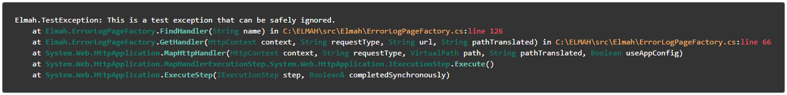

# netStack.js
[](https://www.npmjs.com/package/netstack.js)
[](#)

A simple and easy jQuery plugin for highlighting .NET stack traces

#### Stacktrace - Language support
[](#) [](#) [](#)

#### Demo
[](https://elmah.io/tools/stack-trace-formatter/)

[Stack Trace Formatter - Online pretty print of .NET stack traces](https://elmah.io/tools/stack-trace-formatter/)

#### Initialization
```
$('.stacktrace').netStack();
```

#### Default values for classes
```
$('.stacktrace').netStack({
    prettyprint: false,
    frame: 'st-frame',
    type: 'st-type',
    method: 'st-method',
    paramsList: 'st-frame-params',
    paramType: 'st-param-type',
    paramName: 'st-param-name',
    file: 'st-file',
    line: 'st-line'
});
```

#### Ready to go css
```
pre, code {background-color:#333; color: #ffffff;}
.st-type {color: #0a8472; font-weight: bolder;}
.st-method {color: #70c9ba; font-weight: bolder;}
.st-frame-params {color: #ffffff; font-weight: normal;}
.st-param-type {color: #0a8472;}
.st-param-name {color: #ffffff;}
.st-file {color:#f8b068;}
.st-line {color:#ff4f68;}
```
